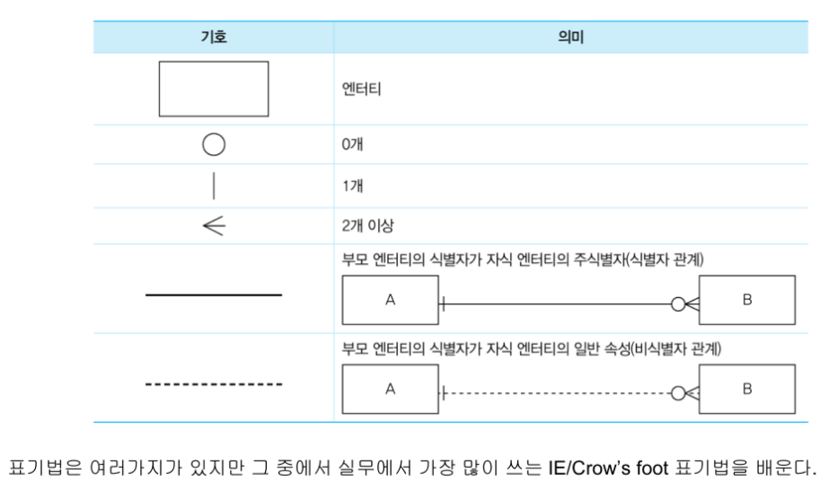

# DB 모델링

### 1. 개념

현실에 필요한 데이터를 저장하하는 `DB를 구축하기 위한 분석 및 설계`

### 3가지 모델링

1. 개념적 데이터 모델링

   -  모델링의 1차 작업, 추상적 모델링\
      `업무 중심적, 포괄적 수준의 모델링`

2. 논리적 데이터 모델링

   -  재사용성이 가장 높은 모델링
   -  데이터 베이스 모델에 대한 [ key, 속성, 관계 ] 등을 모두 표현함

3. 물리적 데이터 모델링

   -  실제 데이터베이스로 구현할 수 있도록 `성능, 가용성 등의 물리적 성격을 고려`하여 만든 모델을 표현함

-  ERD 작성 (엔티티 설계도)
   -  크라우프 표기법

-

## 스키마

-  **외부 스키마** : 사용자의 관점,, 각 사용자가 보는 DB의 스키마
-  **개념 스키마**
   -  통합적 관점,, 모든 사용자가 보는 DB의 스키마를 통합 => 전체DB를 나타냄
   -  DB에 저장되는 데이터를 표현 및 데이터들간의 관계와 제약조건 나타냄
-  **내부 스키마**

   -  물리적 관점으로 물리적 저장 구조를 나타냄
   -  실질적 데이터의 저장 구조나 컬럼 정의 등 포함
   -  일반적 스키마는 내부 스키마를 뜻함

-  스키마의 분리 이유?
   1. 논리적 독립성: 개념 스키마가 변경되어도 외부 스키마는 영향받지 않음.
   2. 물리적 독립성: 내부 스키마가 변경되더도 [ 외부/개념 ] 스키마는 영향받지 않음.

## 엔티티(Entity) - 행(row) / 열(column)

### 속성과 인스턴스 & 스키마

각 엔티티는 자세하게 표현하기 위해 속성(Attribute)를 갖춤

-  열(column)

   -  속성(Attribute) : 열

   -  도메인: 열마다 지정한 조건범위 (데이터 유효성 검사)

-  행(row)
   -  인스턴스 : DB에서 데이터값을 소지하고 있는상태로 테이블의 물리적 행과 같다.
   -  튜플 : 실체를 가지지 않은 추상적인 단어로,, 이론적 행과 같다.

## 속성과 인스턴스 & 스키마

-  **스키마**

   

   -  정의된 이름을 가진 속성들과 제약조건에 묶인 도메인들
   -  AND
   -  정의된 데이터를 가진 행들
   -  의 합이 모여 만들어진 실제적 테이블

-  **릴레이션**

   

   -  속성들은 정의하였지만 구체적 제약조건은 정의되지 않은(=도메인) column(열)
   -  AND
   -  값이 정의되지 않은 인스턴스(=튜플)인 row(행)
   -  로 구성된 추상적 테이블 (실제하는 값은 없으며 구조만 설계된 상태)

-  **속성**
   -  한 속성에는 하나의 속성값을 가져야함
   -  인스턴스와 속성이 교차하는 지점에 2개 이상의 데이터를 가진경우\
      => 속성은 2개 이상의 다른 테이블이 병합된 상태\
      => 최종으로 보이는 테이블에서 한 셀에 여러 데이터를 갖고있다\
      => 그 데이터의 수만큼 테이블이 독립적으로 존재함
