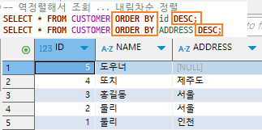

### SELECT

-  **전체선택** : **SELECT** **FROM** **_[TABLE_name]_**\
   

-  **SELECT** (column) **FROM** [ TABLE_NAME or * ]

-  선택한 열의 같은 값이나 이름있으면 그것들은 병합해서 보여줌\
    SELECT [column1,column2...] FROM [TABLE_NAME] **_GROUP BY_** [column1,column...];

-  ### 순서 정렬 조회

   -  #### $\textsf{\color{darkred}{오름차순 정렬 : ORDER BY ASC}}$

      **SELECT \* FROM** [TABLE] **ORDER BY** [COLUMN] **ASC;**\
       

   -  내림차순 정렬 : **ORDER BY** [COLUMN] **DESC**\
      

-  숫자는 SUM을 이용해 합칠 수 있음\
    **SELECT** _COLUMN_1_, _**SUM**(COLUMN_2)_ **AS** **_SUM_** **FROM** _TABLE_NAME_ **GROUP BY** _COLUMN_1_;

-  COUNT를 이용해 횟수도 찾을 수 있음\
    **SELECT** [column1], **COUNT**([column2]) **AS** **_COUNT_** **FROM** [TABLE_NAME] **GROUP BY** [column1];

### 조건검색 (WHERE)

-  비교 연산자 : [ =, >, <, >=, != ]
   -  예시\
      
-  논리 연산자 : [ AND, OR, NOT ]
   

-  산술 연산자 : [ (), *, / , +, - ]
-  합성 연산자 : [ || ] (문자와 문자를 연결할 때 사용// .으로 연결됌)

### Foreign Key (FK) (외래키)

-  왜래키는 다른 테이블의 기본키를 참조\

### 서브쿼리 (포함, 부분집합)

-  서브쿼리의 위치에 따라 부르는 이름

   |        위치        |      이름       |
   | :----------------: | :-------------: |
   |      SELECT절      | 스칼라 서브쿼리 |
   |       FROM절       |    인라인 뷰    |
   | WHERE절, HAVING 절 |  중첩 서브쿼리  |

-  **스칼라 서브 쿼리**\
   주로 **SELECT절**에 위치\
    컬럼대신 사용되므로 반드시 하나의 값만을 반환해야 한다

```diff
SELECT T1.STUDENT_NO,
       (SELECT T2.STUDENT_NAME
        FROM ACADEMY_B T2
        WHERE T2.STUDENT_NO = T1.STUDENT_NO) AS NAME
FROM ACADEMY_A T1;
```

-  **인라인 뷰**\
   : 인라인 뷰 FROM절에 SELECT 구문이 옴

   ```
   SELECT T1.STUDENT_NO, T2.STUDENT_NAME
   FROM ACADEMY_A T1,
      (SELECT STUDENT_NO, STUDENT_NAME
       FROM ACADEMY_B) T2
   WHERE T1.STUDENT_NO = T2.STUDENT_NO;

   ```

-  **중첩 서브쿼리**\
    : 중첩 서브 쿼리는 메인쿼리와의 관계에 따라 비연관, 연관 서브쿼리로 나눔

   -  연관 서브쿼리(Correlated Subquery)\
       => 메인 쿼리와 관계를 맺고 있음 (서브쿼리에 메인 쿼리 컬럼이 있음)

   ```diff
   SELECT STUDENT_NO
   FROM ACADEMY_A T1
   WHERE STUDENT_NAME = (SELECT T2.STUDENT_NAME
                         FROM ACADEMY_B T2
                         WHERE T2.STUDENT_NO = T1.STUDENT_NO);
   ```

-  **비연관 서브쿼리(Uncorrelated Subquery)**\
   : 메인쿼리와 관계를 맺고 있지 않음 (서브쿼리에 메인 쿼리 컬럼이 없음)

   ```diff
   SELECT *
   FROM ACADEMY_A
   WHERE STUDENT_NAME = (SELECT STUDENT_NAME
                         FROM ACADEMY_B
                         WHERE STUDENT_NO = 1003);
   ```

$\textsf{\textbf{ 중첩 서브 쿼리는 변환하는 데이터에 형태에 따라 \color{orange}{단일행, 다중행, 다중컬럼} \color{black} {서브쿼리로 나눔}}}$

-  **단일행 서브쿼리(Single Row Subquery)**

-  HAVING 절은 집계 결과에 조건을 거는 곳
-  TRUNC는 집계함수가 아니기에 오류가남

| 함수                     | 설명                      |        예제         |
| :----------------------- | :------------------------ | :-----------------: |
| SUM()                    | 컬럼의 합계               |     SUM(PRICE)      |
| AVG()                    | 컬럼의 평균               |     AVG(PRICE)      |
| COUNT()                  | 행의 수 계산              |    COUNT(PRICE)     |
| MIN()                    | 최소값 반환               |     MIN(PRICE)      |
| MAX()                    | 최대값 반환               |     MAX(PRICE)      |
| VARIANCE()               | 분산 계산                 |   VARIANCE(PRICE)   |
| STDDEV()                 | 표준 편차 계산            |    STDDEV(PRICE)    |
| GROUP_CONCAT() (MySQL)() | 그룹의 값을 문자열로 연결 | GROUP_CANCAT(PRICE) |
